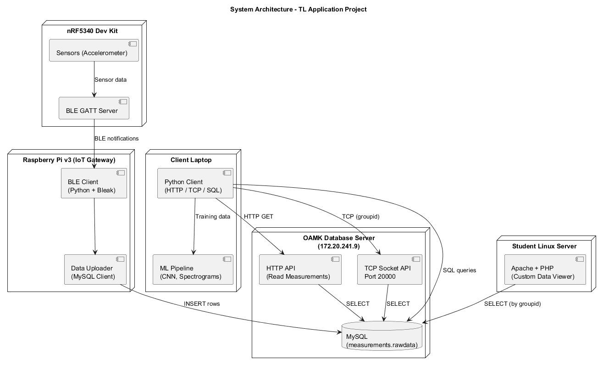

# Tietoliikenneprojekti 2025 - Group 15

> IoT-sensoridatan keräys, tallennus ja haku useilla protokollilla

[](https://www.python.org/)
[](LICENSE)
[](https://github.com/TervonenN/tlprojekti2025_group15)

## 📋 Sisällysluettelo

- [Yleiskatsaus](#yleiskatsaus)
- [Järjestelmäarkkitehtuuri](#järjestelmäarkkitehtuuri)
- [Ominaisuudet](#ominaisuudet)
- [Teknologiat](#teknologiat)
- [Projektivaiheet](#projektivaiheet)
- [Tiimi](#tiimi)

---

## 🎯 Yleiskatsaus

Tämä projekti on toteutettu osana tietoliikenteen sovellusprojekti-kurssia 2025. Projektin tavoitteena on kerätä sensoridata IoT-laitteesta (nRF5340 Dev Kit) Bluetooth Low Energy (BLE) -protokollalla, tallentaa se MySQL-tietokantaan ja tarjota data useilla eri protokollilla.

**Kerättyä dataa hyödynnetään lopulta Machine Learning -mallien kouluttamiseen** sensoriarvojen analyysiin, ennustamiseen ja poikkeavuuksien havaitsemiseen.

### Projektin pääkomponentit

1. **BLE-sensoridata**: nRF5340 Dev Kit → Raspberry Pi
2. **MySQL-tietokanta**: Datan tallennus ja hallinta
3. **HTTP REST API**: JSON/CSV-muotoinen data
4. **Python-asiakasohjelmat**: Kolme eri tapaa hakea data
5. **Verkkoanalyysi**: Wireshark-pakettikaappaukset
6. **Machine Learning**: Datan analysointi ja ennustaminen *(tuleva vaihe)*

---

## 🏗️ Järjestelmäarkkitehtuuri



### Komponentit

#### 🔧 Laitteet ja palvelimet

- **nRF5340 Dev Kit**: BLE-sensori joka lähettää mittausdataa
- **Raspberry Pi v3**: BLE-vastaanotin, data logger, MySQL-tietokanta
- **Linux Server (Ubuntu)**: Apache web server, MySQL, API-endpointit
- **Client Laptop (Windows)**: Python-asiakasohjelmat, Wireshark-analyysi

#### 📡 Protokollat

| Protokolla | Portti | Käyttötarkoitus |
|------------|--------|-----------------|
| **BLE** | - | Sensoridata nRF5340 → Raspberry Pi |
| **HTTP** | 80 | REST API JSON/CSV-datan hakemiseen |
| **MySQL** | 3306 | Suora tietokantayhteys |
| **SSH** | 22 | Palvelimen etähallinta |

---

## ✨ Ominaisuudet

### 📊 Datan keruu ja tallennus

- ✅ BLE-sensoridata kerätään automaattisesti nRF5340 Dev Kit:stä
- ✅ Tallennus Raspberry Pi:n MySQL-tietokantaan aikaleimalla
- ✅ Tuki useille ryhmille (Group ID 1-999)
- ✅ Automaattinen MAC-osoitteen ja laitetunnuksen tallennus


### 🌐 Web-palvelin

- ✅ Apache HTTP Server
- ✅ PHP-pohjainen REST API
- ✅ JSON ja CSV vastausformaatit
- ✅ Custom 404-virhesivu

### 🔍 Verkkoanalyysi

- ✅ Wireshark-pakettikaappaukset
- ✅ TCP/HTTP/MySQL-protokollien analysointi
- ✅ TCP 3-way handshake -dokumentaatio
- ✅ HTTP GET/POST pyyntöjen tarkastelu

---

## 🛠️ Teknologiat

### Backend

- **Python 3.1.**: Asiakasohjelmat ja data-analyysit
- **MySQL**: Relaaatiotietokanta
- **Apache 2**: Web server
- **PHP 8.x**: REST API backend
- **Linux (Ubuntu)**: Palvelinkäyttöjärjestelmä
- **Raspberry Pi OS**: IoT-gateway ja data logger

### Tools

- **Wireshark**: Verkkoliikenteen analysointi
- **Visual Studio Code**: Kehitysympäristö
- **Git/GitHub**: Versionhallinta
- **SSH**: Palvelimen etähallinta

### Wireshark-analyysi

Projekti sisältää verkkoliikenteen analyysin Wiresharkilla.

**Analysoitavat protokollat:**

1. **TCP 3-way handshake**
   ```
   tcp.flags.syn == 1
   ```

2. **HTTP-liikenne**
   ```
   tcp.port == 80
   http
   ```

3. **MySQL-liikenne**
   ```
   tcp.port == 3306
   mysql
   ```

---

## 📚 Projektivaiheet

Projekti toteutettiin kolmessa vaiheessa:

### 🔹 Vaihe 1: BLE-sensoridata ja tietokanta

**Tavoite:** Kerätä BLE-sensoridata ja tallentaa MySQL-tietokantaan

**Toteutus:**
- ✅ Raspberry Pi:n asennus ja konfigurointi
- ✅ MySQL-tietokannan luonti ja taulurakenne
- ✅ nRF5340 Dev Kit BLE-sensorin kytkeminen
- ✅ Python BLE-client datan vastaanottoon
- ✅ Automaattinen tallennus tietokantaan

**Tulokset:**
- BLE-sensori lähettää dataa itse määritellyin väliajoin.
- Data tallennetaan `rawdata`-tauluun
- MAC-osoite ja aikaleima kirjataan automaattisesti

**Dokumentaatio:**

---

### 🔹 Vaihe 2: HTTP REST API ja verkkoanalyysi

**Tavoite:** Tarjota data HTTP API:n kautta ja analysoida verkkoliikenne

**Toteutus:**
- ✅ Apache web serverin asennus Linux-palvelimelle
- ✅ PHP REST API:n toteutus (JSON/CSV)
- ✅ Python HTTP-client datan hakemiseen
- ✅ Wireshark-pakettikaappaukset
  - TCP 3-way handshake
  - HTTP GET-pyynnöt
  - HTTP-vastaukset
- ✅ Custom 404-virheviesti (kissakuvat cataas.com:sta)

**Tulokset:**
- REST API tarjoaa datan kahdessa formaatissa
- HTTP-protokollan analysointi Wiresharkilla
- Dokumentaatio TCP/IP-pinosta


---

### 🔹 Vaihe 3: MySQL-client ja TCP Socket API

**Tavoite:** Suora tietokantayhteys ja matalan tason TCP-kommunikaatio

**Toteutus:**
- ✅ Python MySQL-client (PyMySQL)
- ✅ SQL-kyselyt suoraan tietokantaan
- ✅ TCP Socket API toteutus palvelimella
- ✅ Python Socket-client
- ✅ Wireshark MySQL-protokollan analysointi
- ✅ Vertailu: HTTP vs MySQL vs Socket
- ✅ Projektin dokumentointi ja viimeistely

**Tulokset:**
- Kolme eri tapaa hakea sama data
- Suorituskyvyn ja kompleksisuuden vertailu
- Kokonaisvaltainen verkkoprotokollien ymmärrys


---

## 📊 Protokollien vertailu

| Ominaisuus | HTTP API | MySQL Direct | TCP Socket |
|------------|----------|--------------|------------|
| **Nopeus** | Keskitaso | Nopein | Nopea |
| **Helppous** | Helppokäyttöisin | Keskitaso | Vaativin |
| **Turvallisuus** | Hyvä (HTTPS) | Hyvä (SSL) | Perus |
| **Formaatti** | JSON/CSV | SQL rows | Raw text |
| **Käyttötapaus** | Web/Mobile apps | Data-analytiikka | IoT/Embedded |
| **Portti** | 80 | 3306 | 20000 |

---

## 🧪 Testaus

### Verkkoanalyysi

**Wireshark-suodattimet:**

```
# TCP 3-way handshake
tcp.flags.syn == 1

# HTTP-liikenne
tcp.port == 80 && http

# MySQL-liikenne
tcp.port == 3306 && mysql

# Socket API
tcp.port == 20000
```

---

## 🐛 Tunnetut ongelmat ja rajoitukset

### HTTP API
- ⚠️ Ei autentikointia (kuka tahansa voi hakea dataa)
- ⚠️ Ei HTTPS-tukea (salaamaton liikenne)

### MySQL
- ⚠️ Salasana plaintext config-tiedostossa
- ⚠️ Ei SSL-yhteyttä

### Socket API
- ⚠️ Toimii vain palvelimen localhost:ista
- ⚠️ Ei virheenkäsittelyä protokollatasolla

---

## 👥 Tiimi

**Group 15**

- **Niko Tervonen** - TervonenN
- **Meri-Tuulia Turtinen** - m351351

**Kurssi:** Tietoliikenteen sovellusprojekti 2025  
**Toteutusaika:** Syksy 2025

---

## 📄 Lisenssi

Tämä projekti on lisensoitu **MIT-lisenssillä**.

Katso [LICENSE](LICENSE) lisätietoja varten.


---

## 🙏 Kiitokset

- **Kurssin ohjaajat** - Ohjaus ja tekninen tuki
- **Nordic Semiconductor** - nRF5340 Dev Kit dokumentaatio
- **Python-yhteisö** - Erinomaiset kirjastot (requests, PyMySQL)

---

## 📌 Status

 **Projekti kesken** (20.11.2025)

Kolme vaihetta suoritettu:
- ✅ Vaihe 1: BLE ja tietokanta
- ✅ Vaihe 2: HTTP API ja Wireshark
- ✅ Vaihe 3: MySQL client ja Socket API

---

<div align="center">

**Tehty ❤️:llä Group 15:n toimesta**

[](https://github.com/TervonenN/tlprojekti2025_group15/stargazers)

</div>