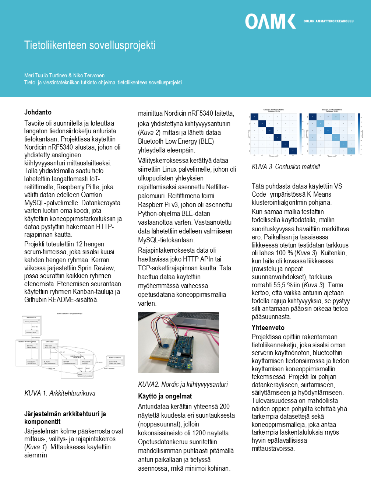
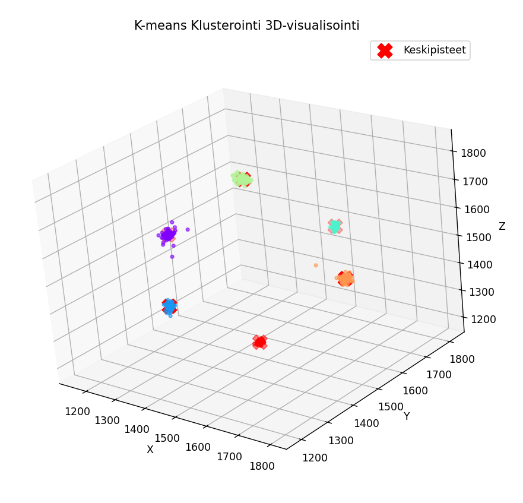
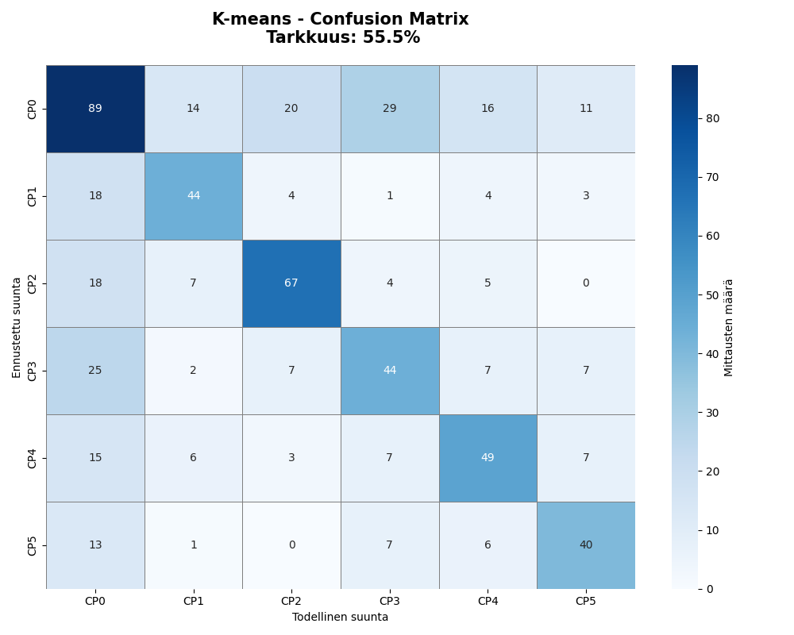

# Tietoliikenteen sovellusprojekti 2025 / Ryhmä 15

> IoT-sensoridatan keräys, tallennus ja haku - nRF5340 DK, Raspberry & Linux/MySQL

## 📋 Sisällysluettelo

- [Yleiskatsaus](#-yleiskatsaus)
- [Järjestelmäarkkitehtuuri](#-järjestelmäarkkitehtuuri)
- [Teknologiat](#-teknologiat-ja-työkalut)
- [Projektivaiheet](#-projektin-eteneminen-viikoittain)
- [K-means-luokittelu](#-k-means-luokittelu)
- [Tulokset](#-tulokset)
- [Tiimi](#-tiimi)
- [Lisenssi](#-lisenssi)

---

## 🎯 Yleiskatsaus

Tämä projekti on toteutettu osana Oulun ammattikorkeakoulun **Tietoliikenteen sovellusprojekti-kurssia** syksyllä 2025. Projekti yhdistää IoT-laitteet, langattoman tiedonsiirron, tietokantahallinnan ja koneoppimisen kokonaisuudeksi, joka havaitsee ja luokittelee laitteen suuntaa kiihtyvysanturidatan perusteella

### 🎯 Projektin Tavoitteet
Projektin päätavoitteena on rakentaa toimiva IoT-järjestelmä, jossa:
- **NRF5340 Development Kit** - mikrokontrolleri mittaa kiihtyvyysanturidataa
- Data välitetään **Bluetooth Low Energy (BLE)** - yhteydellä Raspberry Pi:lle.
- Raspberry Pi tallentaa datan **MYSQL-tietokantaan**
- **K-means-koneoppimisalgoritmi** opetetaan luokittelemaan laitteen suunta
- Opetettu malli siirretään takaisin mikrokontrollerille reaaliaikaiseen päättelyyn
- Mallin tarkkuus arvioidaan Confusion Matrix -analyysillä

---

## 🖼️ Projektin Juliste (Posteri)

Juliste tarjoaa tiivistetyn yleiskuvan projektin tavoitteista, menetelmistä ja keskeisistä tuloksista.

---

## 🏗️ Järjestelmäarkkitehtuuri

### Komponentit

### Komponentit

| Komponentti | Rooli | Teknologia |
|-------------|-------|------------|
| **nRF5340 Dev Kit** | Sensorilaite | Zephyr RTOS, C, BLE |
| **Raspberry Pi v3** | IoT Gateway | Python, Bleak |
| **MySQL Server** | Tietokanta | MySQL 8.0 |
| **Linux Server** | Web-palvelin | Apache, PHP |
| **Client Laptop** | Kehitys & ML | Python, NumPy |

---

## 🔧 Teknologiat ja Työkalut

### Laitteisto
- **nRF5340 Development Kit**: Nordic Semiconductorin kehitysalusta
- **Raspberry Pi v3**: IoT-reititin ja BLE-väylä
- **Ubuntu Linux -palvelin**: Web-palvelin ja sovellusrajapinnat
- **Kiihtyvyysanturi**: 3-akselinen anturi (x, y, z -mittaukset)

### Ohjelmistot ja Protokollat
- **Zephyr RTOS** - Mikrokontrollerin käyttöjärjestelmä
- **Bluetooth Low Energy (BLE)** - Langaton tiedonsiirto
- **Python 3.x** - Datan käsittely ja koneoppiminen
  - `mysql-connector-python` - Tietokantayhteys
  - `numpy` - Matriisioperaatiot ja K-means-algoritmi
  - `matplotlib` - Visualisointi
  - `bleak` - BLE-kommunikaatio (Nordic-yhteensopiva)
- **MySQL** - Relaatiotietokannat
- **Apache + PHP** - Web-palvelin ja HTTP-rajapinnat
- **Git & GitHub** - Versionhallinta ja projektin dokumentointi

### Kehitystyökalut
- **Visual Studio Code** - Pääasiallinen kehitysympäristö
- **nRF Connect** - BLE-yhteyksien testaus ja debuggaus
- **Wireshark & tcpdump** - Verkkoliikenteen analysointi
- **Thunder Client** - REST API -testaus
- **WinSCP** - Tiedostojen siirto palvelimille
---

## 📊 Projektin Eteneminen Viikoittain

### Viikko 1: Projektin Perustus ja Työkalut
**Toteutetut toiminnot:**
- GitHub-repositoryn ja Kanban-taulun käyttöönotto
- nRF5340 Development Kit -alustan asennus ja kiihtyvyysanturin testaus
- Git-versionhallinnan perusteet ja arkkitehtuurikaavion suunnittelu
- Linux-alkeet (ssh, cmhmod, palomuurit jne.)

**Opitut taidot:**
- Scrum-menetelmä
- Git-työskentely
- Markdown-dokumentointi
- Kanban

---

### Viikko 2: BLE-kommunikaatio ja ADC-integraatio

**Toteutetut toiminnot:**
- WorkingADCSolution-ohjelman kääntäminen ja ADC-lukeminen
- Nordic Academy BLE Fundamentals -kurssin sertifikaatti
- nRF Connect -sovellus ja BLE GATT -palveluiden toteutus
- ADC + BLE -integraatio

**Opitut taidot:**
- BLE-protokolla (GATT, Services)
- nRF Connect
- ADC-integraatio
- Zephyr RTOS

---

### Viikko 3: Tiedonsiirto, Palvelimet ja Rajapinnat

**Toteutetut toiminnot:**
- Raspberry Pi + Python BLE-client (Bleak) -> MySQL
- Apache + PHP -asennus ja Netfilter-palomuuri Linux-palvelimelle
- TCP-asiakasohjelmat: HTTP-client, MySQL Direct, Socket (port 20000)
- Wireshark-analyysi (TCP, HTTP, MySQL)

**Opitut taidot:**
- BLE-kommunikaatio (Bleak)
- MySQL-operaatiot
- Web-palvelinkonfigurointi
- Wireshark
- SSH ed25519

---

### Viikko 4: Lisenssit ja REST API

**Toteutetut toiminnot**
- Ohjelmistolisenssivertailu ja MIT-lisenssin valinta projektille
- Apache ErrorDocument -konfiguraatio (custom 404 + cataas.com API)
- Thunder Client -testaus (Ilmatieteenlaitos, Oulun liikenne GraphQL)
- Python-skriptit (CSV, MYSQL, Socket)

**Opitut taidot:**
- Lisenssimallit
- HTTP-virhekäsittely
- API-testaus

### Viikko 5: K-means-opetus Pythonilla

**Toteutetut toiminnot**
- Datan haku ja esikäsittely
- K-means-algoritmin toteutus NumPyllä
- Iteratiivinne optimointi ja konvergenssin tarkistus
- Keskipisteiden vienti C-koodiksi (`keskipisteet.h`)

**Opitut taidot:**
- K-means-algoritmi (ilman scikit)
- NumPy-vektorointi
- Mallin vienti C:hen

**Miksi itse?** Syvempi ymmärrys, täysi kontrolli sekä kevyempi ratkaisu

---

###  Viikko 6: Mallin Implementointi Laitteelle

**Toteutetut toiminnot**
- GitHub-repon kloonaus ja `keskipisteet.h`-integrointi
- `confusion.c`-moduulin täydentäminen (etäisyyslaskenta, K-means-päättely)
- 600 mittauksen suoritus (100 per suunta 0-5)
- Confusion matrix -laskenta Python-skriptillä

**Opitut taidot**
- Edge computing
- Mallin optimointi mikrokontrollerille
- Confusion matrix

---

### Viikko 7: Viimeistely ja Dokumentointi
- Datan visualisointi (K-means-klusterit 3D, confusion matrix heatmap)
- Projektiposteri
- Loppuesitys Scrum-tiimille
- GitHub-dokumentaation viimeistely

**Opitut taidot:**
- Posterin suunnittelu
- Tekninen esitystaito
- Kattava dokumentointi

---

## 🤖 K-means-luokittelu

### Algoritmin Toiminta

**K-means** on ohjaamaton koneoppimisalgoritmi, joka ryhmittelee datapisteet klusteriksi niiden samankaltaisuuden perusteella. Algoritmi etsii 6 keskipistettä 3D-avaruudessa (x, y, z), jotka parhaiten edustavat kutakin suuntaa.

**Toteutus:**

1. **Opetus (Python)**: Kerättiin kiihtyvyysanturidataa ja opetettiin K-means-algoritmi NumPy-kirjastolla. "Tyhjästä" ilman scikit-learn -kirjastoja saavuttaaksemme syvemmän ymmärryksen.

2. **Mallin vienti**: Opetetut 6 keskipistettä vietiin C-kieliseksi taulukoksi (`keskipisteet.h` -tiedosto), joka voidaan sisällyttää suoraan mikrokontrollerin koodiin.

3. **Päättely (nRF5340)**: Mikrokontrolleri laskee jokaisen uuden mittauksen (x, y, z) etäisyyden kaikkiin 6 keskipisteeseen. Lähin keskipiste määrittää ennustetun suunnan.

### Klustereiden Visualisointi

*3D-visualisointi opetetuista klustereista. Jokainen väri edustaa yhtä suuntaa ja punaiset X-merkit laskettuja keskipisteitä.

## 📈 Tulokset

### Confusion Matrix

## 👥 Tiimi

**Group 15**

- **Niko Tervonen** - TervonenN
- **Meri-Tuulia Turtinen** - m351351

**Kurssi:** Tietoliikenteen sovellusprojekti 2025  
**Toteutusaika:** Syksy 2025

---

## 📄 Lisenssi

Tämä projekti on lisensoitu **MIT-lisenssillä**.

Katso [LICENSE](LICENSE) lisätietoja varten.

---

## 🙏 Kiitokset

Kiitos ohjaajille **Teemu Korpela** (t2946282) ja **Kari Jyrkkä** (kajyrkka) erinomaisesta ohjauksesta ja tuesta projektin aikana

Kiitos myös Oulun ammattikorkeakoululle laitteistojen ja infrastruktuurin tarjoamisesta.

---

**Oulun ammattikorkeakoulu** | Tietoliikenteen sovellusprojekti 2025 | Ryhmä 15

*Projekti suoritettu syksyllä 2025 osana 15 opintopisteen kokonaisuutta, joka sisälsi sovellusprojektin, viestinnän ja liiketoimintaosaamisen osa-alueet.

**Tehty ❤️:llä Group 15:n toimesta**

